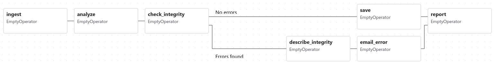
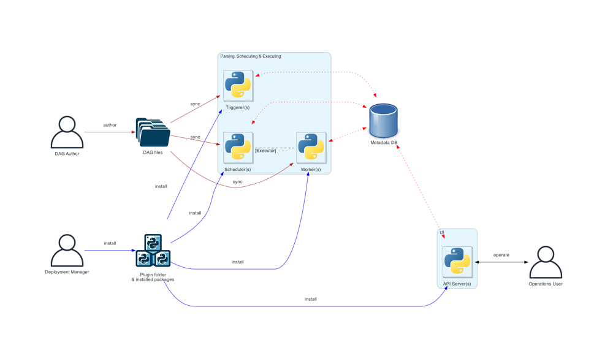

# Service Architecture

This service is built using the [Apache/Airflow](https://airflow.apache.org/) tool. Apache Airflow is an open-source platform for developing, scheduling, and monitoring batch-oriented workflows. It offers an extensible Python framework that enables us to build workflows connecting with virtually any technology. A web-based UI helps us visualize, manage, and debug our workflows.

## Why Apache Airflow

Apache Airflow was selected as the orchestration layer for this solution because it provides explicit, observable, and resilient workflow coordination across multiple services. The platform is particularly well-suited for environments where execution order, timing, and reliability are first-class architectural concerns. Rather than embedding orchestration logic inside individual services, Airflow centralizes workflow control while keeping services loosely coupled and independently deployable.

### Explicit Workflow Orchestration

In Airflow, workflows are defined declaratively using _"Directed Acyclic Graphs"_, in short **DAGs**. Inside a DAG, dependencies between execution steps are explicit, deterministic and inspectable. These individual execution pieces of work are called Tasks, arranged with dependencies and data flows taken into account.

A Dag specifies the dependencies between tasks, which defines the order in which to execute the tasks. Tasks describe what to do, be it fetching data, running analysis, triggering other systems, or more.

### Workflows as code

Airflow workflows are defined entirely in Python. This "workflows as code" approach brings several advantages:

- **Dynamic**: Pipelines are defined in code, enabling dynamic DAG generation and parameterization.
- **Extensible**: The Airflow framework includes a wide range of built-in operators and can be further extended to cover a wide variety of programming needs.

### Centralized Control Without Centralized Logic

Airflow acts as a control plane, not a business logic engine:

- Services remain autonomous and focused on domain responsibilities
- Airflow coordinates when and under what conditions services interact
- No service needs awareness of downstream consumers or execution order

This architecture reduces cross-service dependencies, improves service reusability and enables independent scaling and deployment.

### Built-in Reliability and Failure Semantics

Airflow provides failure handling as a core architectural feature:

- Task-level retries with configurable backoff
- Timeouts and execution limits
- Partial re-runs without restarting from the beginning

This allows the system to recover gracefully from transient service outages, avoid cascading failures and maintain predictable operational behavior.

### Strong Observability and Operational Transparency

Airflow exposes execution state as part of its core model. DAGs and their tasks can be inspected visually, as well as logs and timestamps kept.
Also, the historical audit trail of all workflow executions is kept.

These features provide immediate insight into system behavior and even controlled manual intervention when required.

## Techical Information

Airflow's core components include the following, which form the backbone of its orchestration system:

### Scheduler

The scheduler is the heart of Airflow. It continually monitors all DAGs and their tasks, triggering task instances once their dependencies are met. The scheduler is responsible for starting new DAG runs at the appropriate times (based on schedule or manual triggers) and determining which tasks are ready to run next. When a task is ready, the scheduler delegates its execution to an Executor, which will actually launch the task (possibly on a worker). The scheduler process runs indefinitely, polling the DAG definitions and the database for changes, and it orchestrates task execution in a continuous loop.

#### Executor

The executor is the mechanism by which the scheduler distributes tasks for execution. It is configured as part of the scheduler (not a separate daemon). Different executors determine how and where tasks run. We have used the KubernetesExecutor, which launches each task in its own Kubernetes pod for isolation and scalability.

Regardless of executor type, the scheduler's job is to hand tasks to the executor, which then handles the low-level details of starting the task in the appropriate environment.

### Workers

Workers are the processes (or containers) that actually execute the code of the tasks. In a simple setup using the LocalExecutor, the scheduler itself spawns worker processes internally to run tasks. In the distributed setup we have used, workers are separate processes (Kubernetes pods) that run on different machines. Workers continuously poll for tasks from the executor's queue and execute those tasks. Once finished, a worker will report the task's outcome back to the Airflow system (e.g. update task status in the database). Workers can be scaled out horizontally to run many tasks in parallel across multiple machines.

### Web Server

The web server is a FastAPI application that provides Airflow's user interface and RESTful APIs. It allows users to inspect DAGs, view task statuses, trigger runs, and debug workflows. The APIs provided are:

- an internal API for workers to report status or fetch information while running tasks,
- an internal API for the UI to dynamically fetch data (e.g. task updates) without direct database access,
- and the public Airflow REST API for users to programmatically manage the Airflow instance.

The web server/API server does not execute DAG code; it simply displays information and handles user/worker requests. All sensitive operations (like running tasks) are handled by the scheduler and workers. The web server interacts with other components primarily through the metadata database or internal APIs. For security, in a distributed deployment the web server does not read DAG files directly - if a user views DAG code in the UI, it is fetched from the database (where the scheduler/DAG processor stored a serialized version of the DAG).

### Metadata Database

Airflow uses a persistent metadata database to store the state of the system. This database contains DAG definitions (serialized DAGs), task instance states (e.g. success, running, failed), DAG run records, scheduler metadata (like next run times), Airflow configurations, connections, variables, and history of past runs. Essentially, it is the single source of truth for the status of all workflows. Every component in Airflow interacts with this database:

- The scheduler adds DAG run and task instance entries and updates their states as tasks progress.
- Workers (or the tasks they run) update the database when tasks start, succeed, or fail (in newer versions this is done via the API server as an intermediary, rather than direct DB writes).
- The web server reads from the database to display current DAG and task statuses in the UI.

Because of this central role, the metadata DB is a critical component; Airflow cannot run without it.

### DAG Files and DAG Processor

Airflow DAGs are defined by Python files (DAG files) that users (DAG authors) write. These files need to be accessible to the Airflow system. The DAG processor is the component responsible for reading (parsing) these DAG files and storing their structure in the metadata DB for the scheduler to use. This means the DAG parsing is isolated from the main scheduler process, improving scheduler performance and security by clearly separating DAG code execution from scheduling logic. The DAG processor watches the DAG file directories (which can be local filesystems or object storage, depending on configuration), parses DAG definitions on change or at intervals, and saves a serialized version of each DAG to the database. This serialized DAG is what the scheduler actually uses to decide what tasks to run and when. In a multi-machine setup, DAG files must be distributed or synchronized to all places where they are needed (scheduler, any workers, and any triggerers) so that each component can access the latest DAG code. In our setup, this requirement is met by using NFS-mounted directories to ensure DAG files are consistently available across all Airflow components.

### Component Interaction and Communication

In a running Airflow deployment, these components work together to orchestrate workflows. Each component has a well-defined role, and they communicate mainly through the metadata database and, in some cases, through an inter-process messaging system (for task execution). The diagram below (from the official Airflow documentation) illustrates a typical Airflow architecture in a distributed setting with the core components separated:

Each arrow in the figure represents a communication or data flow between components.

### DAG Execution and Task Dependencies

Airflow manages workflow execution by enforcing the dependencies and order defined in each DAG. As mentioned above, a DAG is a directed acyclic graph where nodes are tasks and edges define dependencies (which task comes after which). These dependencies can be set in code (e.g. using task1 >> task2 or similar notation) and effectively create rules like "task2 cannot run until task1 has finished successfully". Here's how Airflow orchestrates tasks within a DAG, step by step:

1. **DAG Parsing and Scheduling**: When a DAG (workflow) is added or updated, the DAG processor or scheduler will load that DAG file, parse the DAG's tasks and dependencies, and save a serialized DAG representation in the metadata database. The scheduler constantly evaluates DAGs to see if a new DAG run should be started - for example, if a DAG is scheduled to run every day at 9 AM, the scheduler will create a new DAG run at that time (if one isn't already running or queued). If a DAG is triggered manually (via UI or API), the scheduler also creates a DAG run promptly. Each DAG run is an instance of the workflow (often corresponding to a specific execution date or data interval).

2. **Dependency Checking and Task Queuing**: Once a DAG run is initiated, the scheduler examines all tasks in that DAG to decide which tasks are ready to run. A task is ready when all its upstream dependencies in the DAG have succeeded (or are skipped, depending on trigger rules) or if it has no upstream dependencies at all. For the first tasks in the DAG (those with no predecessors, or whose predecessors are all done in previous runs), the scheduler will immediately mark them as runnable. The scheduler then puts these task instances into a queue via the executor. In this context, "queue" could be any message broker, or, in our case, the Kubernetes API server (K8s executor launching pods). The scheduler records in the database that those tasks are queued and in what state.

3. **Task Execution on Workers**: Worker processes pick up the queued tasks and begin executing them. Each task instance runs the user-defined code. During execution, the task instance will log its output and may report heartbeat signals to the scheduler to indicate it's still running (this helps detect if tasks hang or the process died).

4. **Task Completion and Result Reporting**: When a task finishes (successfully or with failure), it needs to report its state so that Airflow knows it's done. For security reasons, the task/worker does not directly touch the database. Instead, the worker makes a call to the API server, using an authenticated internal API. The API server in turn writes the delegated information to the metadata database on behalf of the worker. Similarly, if the task needs to fetch connection credentials or other info stored in Airflow's DB (e.g., to get a password from a connection), the worker will call an endpoint on the API server, which will retrieve the data from the DB and return it to the task at runtime. This mechanism enhances security by preventing direct database access from arbitrary task code while still providing the information and persistence needed.

5. **Scheduler Monitoring and Dependency Resolution**: The scheduler is continually running in the background, polling the database for task updates. As soon as a task changes state (for example, from "running" to "success"), the scheduler takes note. It will then check if that task's completion satisfies any dependencies for downstream tasks. In each DAG run, tasks that were waiting on the now-completed task may become eligible to run. The scheduler thus transitions those tasks to the "queued" state and sends them to the executor, as described in step 2. This event-driven scheduling continues until all tasks in the DAG have been completed or the DAG run is otherwise finished (e.g., failed or stopped).

6. **Handling Task Dependencies and Triggers**: By default, Airflow's scheduler uses an "all-success" trigger rule, meaning a task won't run until all of its upstream tasks have succeeded. However, Airflow supports different trigger rules and dependency settings:

   - You can have tasks that run after any one of their upstreams succeeds or fails (by changing trigger rules).
   - You can implement branching in your DAG (using the BranchOperator) where one task's outcome decides which path of tasks to follow, potentially skipping others.
   - You can also set tasks with time-based dependencies or use sensors that wait for external events. Deferrable sensors (with the triggerer) will yield control and let the triggerer handle the waiting to free up workers.
   - Airflow ensures that even with these complex flows, no task runs before its defined prerequisites are met. It keeps track of each task's upstream statuses in the DB and evaluates the dagrun's state holistically. If any task in the DAG fails and that failure is not tolerated by a downstream task's rule, the downstream task will be skipped or failed according to the rules (e.g., a task with "all-success" upstream rule will skip if any upstream failed).

7. **Parallelism and Concurrency**: Airflow can run multiple tasks at the same time as long as they are ready to run and resources allow it. Tasks in the same DAG that have no dependencies on each other (or whose dependencies are already resolved) may be executed in parallel on different workers. Also, multiple DAGs can run concurrently. The system respects configured limits such as maximum concurrency per DAG and global worker pool limits (pools allow you to limit how many tasks of certain type or certain resource usage run simultaneously). The scheduler will not queue more tasks than the system can handle as per these limits. This ensures a single DAG cannot overwhelm the whole system if configured with appropriate limits. Airflow's design, using a central scheduler, ensures that even in highly parallel scenarios, the dependencies and order of execution are correctly maintained.

8. **User Monitoring and Intervention**: Throughout a DAG run, the Airflow Web UI provides visibility into the state of the workflow. The UI (via the API server) fetches the latest task statuses and DAG run information from the metadata DB and displays the DAG's graph or grid view showing which tasks are queued, running, succeeded, or failed. Users can click on tasks to see logs (which the web server retrieves from the log storage), check XCom messages, or mark tasks for retry. If needed, users can intervene via the UI or CLI - for example, they can clear a task (reset its state to let it run again), trigger a backfill or a new run, or pause a DAG to stop scheduling new runs. These actions all update states in the database or send signals to the scheduler, which will then act on them (e.g., if you clear a failed task, the scheduler will treat it as pending and reschedule it). The architecture ensures that user actions are propagated to the scheduler through the same channels (DB or internal APIs), so the scheduler remains the single point orchestrating the actual execution.

Airflow's handling of task orchestration is designed to ensure that task dependencies are honored and that workflows run in the intended order despite a distributed execution. The combination of the scheduler's central brain, the state tracking in the metadata database, and workers executing tasks allows Airflow to reliably manage complex DAGs. It's worth noting that Airflow does not guarantee all tasks of a DAG run on the same worker or machine - tasks will run wherever there is capacity (which is why passing data between tasks is done through XCom or external storage, not local files). This distributed nature provides flexibility and scalability: as your workflow load grows, you can add more workers or another scheduler for redundancy, and Airflow will continue to orchestrate tasks in a consistent manner.
