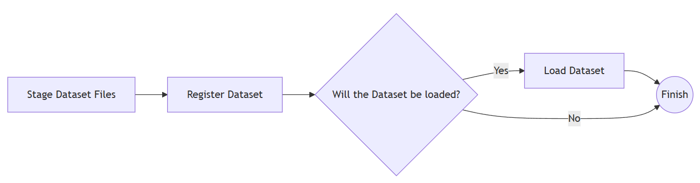

# Dataset Onboarding Workflow

The Dataset Onboarding Workflow provides a unified and controlled process for registering and ingesting datasets into the platform, regardless of their original storage location.
The workflow accepts dataset metadata together with one or more dataset locations and guides the dataset through a well-defined lifecycle that separates physical data handling from logical dataset management.

## Input

In in the initial step, the workflow is provided with the following information:

| Parameter         | Type                                              | Special Format | Mandatory | Description                                                                                                                                                                                                                                                                                                                                       |
| ----------------- | ------------------------------------------------- | -------------- | --------- | ------------------------------------------------------------------------------------------------------------------------------------------------------------------------------------------------------------------------------------------------------------------------------------------------------------------------------------------------- |
| id                | string                                            | uuid           | yes       | A globally unique identifier for the dataset. This identifier is used consistently throughout the workflow to associate metadata, staged files, and lifecycle events with the same dataset entity.                                                                                                                                                |
| code              | string                                            |                | no        | An optional short or human-friendly code used to reference the dataset. This may correspond to an internal catalog code or business identifier.                                                                                                                                                                                                   |
| name              | string                                            |                | no        | The human-readable name of the dataset. Used for display, discovery, and identification purposes.                                                                                                                                                                                                                                                 |
| description       | string                                            |                | no        | A detailed textual description of the dataset contents, scope, and purpose. Helps users understand what the dataset represents and how it can be used.                                                                                                                                                                                            |
| headline          | string                                            |                | no        | A short, high-level summary or tagline describing the dataset. Typically used in user interfaces or dataset listings.                                                                                                                                                                                                                             |
| fields_of_science | array of strings                                  |                | no        | A list of scientific or domain classifications associated with the dataset. Used for categorization, filtering, and discovery.                                                                                                                                                                                                                    |
| languages         | array of strings                                  |                | no        | The languages represented in the dataset content. This may refer to the language of textual data or metadata.                                                                                                                                                                                                                                     |
| keywords          | string                                            |                | no        | Free-form keywords associated with the dataset. Used to improve searchability and discoverability.                                                                                                                                                                                                                                                |
| countries         | array of strings                                  |                | no        |                                                                                                                                                                                                                                                                                                                                                   |
| publishedUrl      | string                                            | uri            | no        | A public or external URL where the dataset is published or described. This may point to documentation, landing pages, or external repositories.                                                                                                                                                                                                   |
| citeAs            | string                                            |                | no        | A recommended citation string for referencing the dataset in publications. Used to support proper attribution and academic reuse.                                                                                                                                                                                                                 |
| conformsTo        | string                                            |                | no        | A reference to a standard, schema, or specification that the dataset conforms to. This may include formal data models or community standards.                                                                                                                                                                                                     |
| license           | string                                            |                | no        | The license under which the dataset is distributed. Defines usage rights, redistribution terms, and legal constraints.                                                                                                                                                                                                                            |
| size              | number                                            | integer        | no        |                                                                                                                                                                                                                                                                                                                                                   |
| dataLocations     | array of objects {Kind: string, location: string} |                | yes       | A list of locations describing where the dataset is physically stored or accessed. Each entry specifies the type of location (e.g. file system, remote service, database), and the corresponding access reference (path, URI, connection, etc.). This parameter is mandatory and drives staging, branching, and loading behavior in the workflow. |
| version           | string                                            |                | no        | The version identifier of the dataset. Used to distinguish between different releases or revisions of the same dataset.                                                                                                                                                                                                                           |
| mime_type         | string                                            |                | no        | The MIME type representing the datase's format (e.g. text/csv, application/json). Helps downstream systems interpret and process the data correctly.                                                                                                                                                                                              |
| date_published    | string                                            | date           | no        | The publication date of the dataset. Used for provenance tracking and lifecycle management.                                                                                                                                                                                                                                                       |
| userId            | string                                            |                | no        | An identifier representing the user or actor initiating the onboarding process. Used for attribution, auditing, and ownership tracking.                                                                                                                                                                                                           |

All the fields except dataLocations contain metadata information. The dataLocations contains the information where the Dataset is located. The following locations are supported:

- File: The dataset is stored inside a file somewhere in the mounted filesystem.
- Http: The dataset can be accessed via a URI.
- Ftp: The dataset is stored inside an FTP server. The location should be an FTP URI.
- Remote: TODO
- Staged: The dataset is already staged.
- Database: The dataset is stored inside a relational database.

## Tasks

This workflow follows the diagram that will be explained below:

#### Stage Dataset Files

This task ensures that all dataset files are available in a controlled, local staging area before the dataset is registered or loaded.
Because datasets may originate from heterogeneous storage systems, this step acts as a normalization phase: regardless of where the data comes from, downstream tasks interact with a consistent file-based representation whenever applicable.
The task iterates over all declared dataset locations and applies the appropriate handling strategy for each one.

If the dataset is already available on the local filesystem, already staged by a previous process, stored in a relational database, or referenced by a location type that does not require materialization, then no action is performed and the location is passed through unchanged.

If the dataset is hosted externally (for example via HTTP or FTP), the dataset files are retrieved from the remote source, stored in a predefined staging directory associated with the dataset and assigned unique filenames to avoid collisions or ambiguity.

The task produces a normalized list of dataset locations that reflects the effective access points for the dataset:

- unchanged locations for sources that do not require staging,
- staged file locations for externally retrieved datasets.

This output is used by subsequent tasks to register the dataset metadata and decide whether the dataset should be physically loaded or only registered.

If any dataset location cannot be accessed, retrieved, or staged successfully, the workflow fails at this step.
This prevents partial or inconsistent dataset onboarding.

#### Register Dataset

This task registers the dataset and its metadata in the central Data Model Management system, making the dataset discoverable, traceable, and addressable within the platform. The task uses the metadata provided at workflow start, together with the effective dataset locations produced by the staging step, to create a canonical dataset representation.
The task returns the response from the Data Model Management system, which is primarily informational; downstream control flow is determined by the dataset location types rather than this response.

If the registration request fails, the workflow terminates immediately. No dataset loading is attempted unless the dataset has been successfully registered.

#### Choose if the Dataset will be loaded

This step determines whether the workflow should proceed with physically loading the dataset or stop after registration. The decision is based on the types of dataset locations associated with the dataset: If the dataset is stored in a relational database, the workflow ends after registration. Otherwise, the workflow continues to the loading step.
By explicitly separating registration from loading, the workflow supports multiple dataset lifecycle patterns while maintaining a consistent onboarding process.

#### Load Dataset

This task performs the physical ingestion of the dataset into downstream systems after it has been successfully registered. Loading is only executed for datasets that require file-based processing. Database-resident datasets and other non-loadable sources are explicitly excluded by the preceding decision step. This operation does not redefine dataset metadata; it acts upon the dataset entity created during registration.

The task returns the response from the Data Model Management system which is primarily informational and does not affect further workflow execution.

If loading fails, the workflow fails at this stage. The dataset remains registered but is not marked as loaded, allowing the issue to be diagnosed and retried without re-registration.
