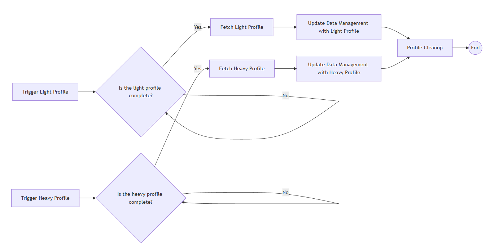

# Dataset Profiling Workflow

## Input

Initially, the workflow is provided with the following information:

| Parameter         | Type             | Special Format | Mandatory |
| ----------------- | ---------------- | -------------- | --------- |
| id                | string           | uuid           | yes       |
| code              | string           |                | no        |
| name              | string           |                | no        |
| description       | string           |                | no        |
| headline          | string           |                | no        |
| fields_of_science | array of strings |                | no        |
| languages         | array of strings |                | no        |
| keywords          | string           |                | no        |
| countries         | array of strings |                | no        |
| publishedUrl      | string           | uri            | no        |
| citeAs            | string           |                | no        |
| conformsTo        | string           |                | no        |
| license           | string           |                | no        |
| size              | number           | integer        | no        |
| version           | string           |                | no        |
| mime_type         | string           |                | no        |
| date_published    | string           | date           | no        |
| userId            | string           |                | no        |
| data_store_kind   | 0 or 1           |                | yes       |
| archivedAt        | string           | path           | yes       |

## Tasks

This workdlow follows the diagram that will be explained below:

#### Trigger Profiles

The execution is plit in two parallel task instance queues, one for light profiling and one for heavy, as shown in the diagram. The first level of tasks ran in parallel get the corresponding authorization token and communicate with the Profiler service to trigger the generation of the profile.

#### Check if the Profiles are ready

When each Trigger task instance described above finishes, a loop is initiated that will finish when the Profiler has the corresponding profile ready to fetch, proceeding to the next step.

#### Fetch Profiles

The task instances get the authorization token required and communicate with the Profiler service to fetch the light and heavy profiles.

#### Update Data Management

These task instances update the dataset by providing the two generated profiles to the Data Model Management service.

#### Profile Cleanup

After both streams are complete, the execution is merged into one and the Profiler service is called again for cleanup.
